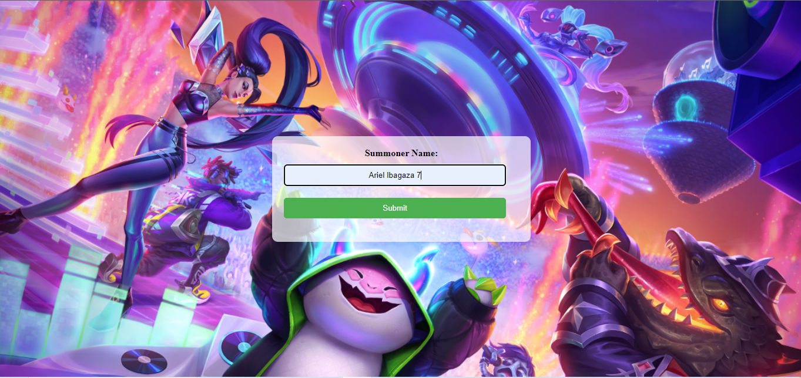
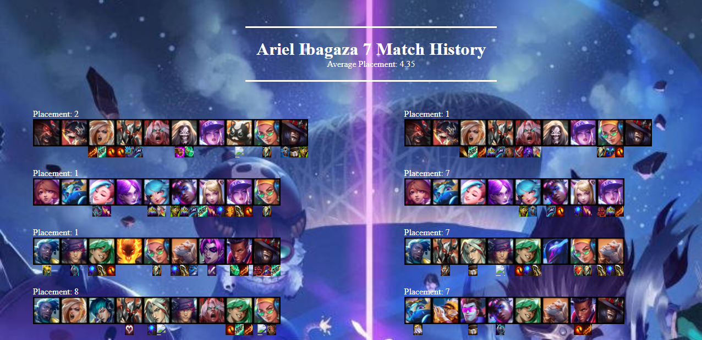

# Flask-based-RESTful-Riot-API-Wrapper
Flask application that integrates with Riot's RESTful API to retrieve the match history of the last 20 games. This application leverages function chaining, API requests, and intermediate JSON indexing to provide comprehensive data, including champion icons and items used in each match.

# Project Structure

- project/
  - api-data-retrieval/
    - get-summoner-data.py
    - get-match-data.py
    - get_match-ids-data-recursive
  - data_processing/
    - index-data.py
    - parsing-data.py
  - flask-app/
    - app.py
    - templates/
      - index.html
    - static/
      - style.css
- README.md

# Project Overview

## Interface


## Result


# TFT Summoner Data Retrieval

These scripts fetches data related to League of Legends (LoL) summoners using the Riot Games API.

## Getting Started

Before running the script, ensure you have an API key from Riot Games. Do not share this API key with anyone.

## Prerequisites
- Python 3
- Requests library

You can install the Requests library using pip:

```python
pip install requests

You can now use the `requests` library in your Python code to make HTTP requests.

## Retrieving Summoner Data

The script retrieves summoner data by following these steps:

1. Acquiring the Summoner PUUID
 -The function get_summoner_data takes a summoner name as input and queries the Riot Games API to retrieve summoner data.
 -Replace the placeholder API key in the script with your actual API key obtained from the Riot Games website.
 -After acquiring the summoner data, the PUUID (Portable Unique ID) is extracted from the response.
2. Using the Summoner PUUID
 - The obtained PUUID can be used for further API requests to fetch more specific data about the summoner, such as match history, match details, and more.
